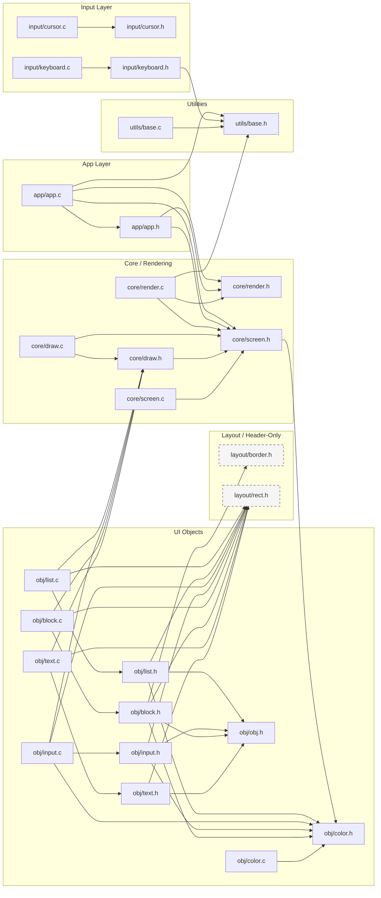

# File dependency diagram

```mermaid
flowchart LR
    subgraph APP ["App Layer"]
        appc["app/app.c"]
        apph["app/app.h"]
    end

    subgraph OBJ ["UI Objects"]
        objh["obj/obj.h"]
        
        blockc["obj/block.c"]
        blockh["obj/block.h"]
        
        inputc["obj/input.c"]
        inputh["obj/input.h"]
        
        listc["obj/list.c"]
        listh["obj/list.h"]
        
        textc["obj/text.c"]
        texth["obj/text.h"]
        
        colorc["obj/color.c"]
        colorh["obj/color.h"]
    end

    subgraph LAYOUT ["Layout / Header-Only"]
        borderh["layout/border.h"]
        recth["layout/rect.h"]
    end

    subgraph INPUT ["Input Layer"]
        cursorc["input/cursor.c"]
        cursorh["input/cursor.h"]
        keyboardc["input/keyboard.c"]
        keyboardh["input/keyboard.h"]
    end

    subgraph CORE ["Core / Rendering"]
        drawc["core/draw.c"]
        drawh["core/draw.h"]
        renderc["core/render.c"]
        renderh["core/render.h"]
        screenc["core/screen.c"]
        screenh["core/screen.h"]
    end

    subgraph UTILS ["Utilities"]
        basec["utils/base.c"]
        baseh["utils/base.h"]
    end

    %% header 
    appc --> apph
    blockc --> blockh
    inputc --> inputh
    listc --> listh
    textc --> texth
    colorc --> colorh
    cursorc --> cursorh
    keyboardc --> keyboardh
    drawc --> drawh
    renderc --> renderh
    screenc --> screenh
    basec --> baseh

    %% --- UI Objects ---
    texth --> recth & objh
    textc --> drawh & recth

    blockh --> borderh & recth & objh & colorh
    blockc --> drawh & recth

    inputh --> recth & objh & colorh
    inputc --> drawh & recth & colorh

    listh --> recth & objh & colorh
    listc --> drawh & recth

    %% --- Input ---
    keyboardh --> baseh

    %% --- Core ---
    drawh --> screenh
    drawc --> screenh
    renderc --> screenh & baseh
    screenh --> colorh

    %% --- App ---
    apph --> renderh & screenh
    appc --> renderh & screenh & baseh

    classDef headerOnly fill:#f5f5f5,stroke:#999,stroke-width:2px,stroke-dasharray: 5 5;
    class borderh,recth headerOnly;
```

---

__version__: *0.2.0* | __author__: *K10-K10* | __update__: 11/06/2026
