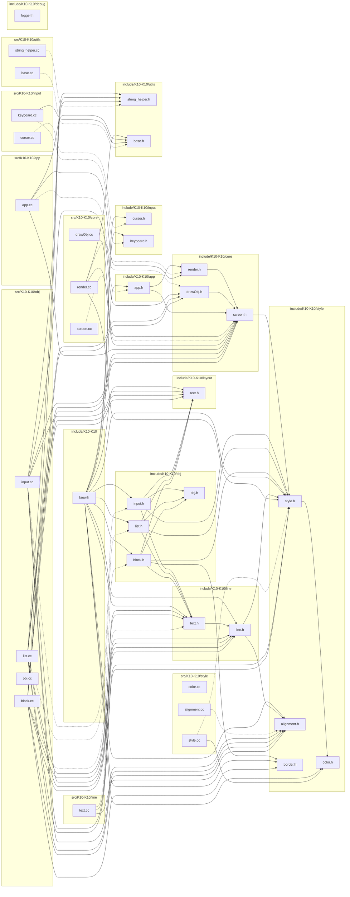

# File dependency diagram

```mermaid
flowchart LR
    subgraph include/K10-K10/core ["include/K10-K10/core"]
        include/K10-K10/core/render.h["render.h"]
        include/K10-K10/core/screen.h["screen.h"]
        include/K10-K10/core/drawObj.h["drawObj.h"]
    end
    subgraph include/K10-K10/style ["include/K10-K10/style"]
        include/K10-K10/style/style.h["style.h"]
        include/K10-K10/style/alignment.h["alignment.h"]
        include/K10-K10/style/border.h["border.h"]
        include/K10-K10/style/color.h["color.h"]
    end
    subgraph include/K10-K10/debug ["include/K10-K10/debug"]
        include/K10-K10/debug/logger.h["logger.h"]
    end
    subgraph include/K10-K10/app ["include/K10-K10/app"]
        include/K10-K10/app/app.h["app.h"]
    end
    subgraph include/K10-K10/layout ["include/K10-K10/layout"]
        include/K10-K10/layout/rect.h["rect.h"]
    end
    subgraph include/K10-K10/obj ["include/K10-K10/obj"]
        include/K10-K10/obj/input.h["input.h"]
        include/K10-K10/obj/obj.h["obj.h"]
        include/K10-K10/obj/list.h["list.h"]
        include/K10-K10/obj/block.h["block.h"]
    end
    subgraph include/K10-K10 ["include/K10-K10"]
        include/K10-K10/krow.h["krow.h"]
    end
    subgraph include/K10-K10/input ["include/K10-K10/input"]
        include/K10-K10/input/cursor.h["cursor.h"]
        include/K10-K10/input/keyboard.h["keyboard.h"]
    end
    subgraph include/K10-K10/line ["include/K10-K10/line"]
        include/K10-K10/line/text.h["text.h"]
        include/K10-K10/line/line.h["line.h"]
    end
    subgraph include/K10-K10/utils ["include/K10-K10/utils"]
        include/K10-K10/utils/string_helper.h["string_helper.h"]
        include/K10-K10/utils/base.h["base.h"]
    end
    subgraph src/K10-K10/core ["src/K10-K10/core"]
        src/K10-K10/core/drawObj.cc["drawObj.cc"]
        src/K10-K10/core/screen.cc["screen.cc"]
        src/K10-K10/core/render.cc["render.cc"]
    end
    subgraph src/K10-K10/style ["src/K10-K10/style"]
        src/K10-K10/style/color.cc["color.cc"]
        src/K10-K10/style/alignment.cc["alignment.cc"]
        src/K10-K10/style/style.cc["style.cc"]
    end
    subgraph src/K10-K10/app ["src/K10-K10/app"]
        src/K10-K10/app/app.cc["app.cc"]
    end
    subgraph src/K10-K10/obj ["src/K10-K10/obj"]
        src/K10-K10/obj/input.cc["input.cc"]
        src/K10-K10/obj/list.cc["list.cc"]
        src/K10-K10/obj/obj.cc["obj.cc"]
        src/K10-K10/obj/block.cc["block.cc"]
    end
    subgraph src/K10-K10/input ["src/K10-K10/input"]
        src/K10-K10/input/keyboard.cc["keyboard.cc"]
        src/K10-K10/input/cursor.cc["cursor.cc"]
    end
    subgraph src/K10-K10/line ["src/K10-K10/line"]
        src/K10-K10/line/text.cc["text.cc"]
    end
    subgraph src/K10-K10/utils ["src/K10-K10/utils"]
        src/K10-K10/utils/string_helper.cc["string_helper.cc"]
        src/K10-K10/utils/base.cc["base.cc"]
    end
    subgraph include/K10-K10/core ["include/K10-K10/core"]
        include/K10-K10/core/render.h["render.h"]
        include/K10-K10/core/screen.h["screen.h"]
        include/K10-K10/core/drawObj.h["drawObj.h"]
    end
    subgraph include/K10-K10/style ["include/K10-K10/style"]
        include/K10-K10/style/style.h["style.h"]
        include/K10-K10/style/alignment.h["alignment.h"]
        include/K10-K10/style/border.h["border.h"]
        include/K10-K10/style/color.h["color.h"]
    end
    subgraph include/K10-K10/debug ["include/K10-K10/debug"]
        include/K10-K10/debug/logger.h["logger.h"]
    end
    subgraph include/K10-K10/app ["include/K10-K10/app"]
        include/K10-K10/app/app.h["app.h"]
    end
    subgraph include/K10-K10/layout ["include/K10-K10/layout"]
        include/K10-K10/layout/rect.h["rect.h"]
    end
    subgraph include/K10-K10/obj ["include/K10-K10/obj"]
        include/K10-K10/obj/input.h["input.h"]
        include/K10-K10/obj/obj.h["obj.h"]
        include/K10-K10/obj/list.h["list.h"]
        include/K10-K10/obj/block.h["block.h"]
    end
    subgraph include/K10-K10 ["include/K10-K10"]
        include/K10-K10/krow.h["krow.h"]
    end
    subgraph include/K10-K10/input ["include/K10-K10/input"]
        include/K10-K10/input/cursor.h["cursor.h"]
        include/K10-K10/input/keyboard.h["keyboard.h"]
    end
    subgraph include/K10-K10/line ["include/K10-K10/line"]
        include/K10-K10/line/text.h["text.h"]
        include/K10-K10/line/line.h["line.h"]
    end
    subgraph include/K10-K10/utils ["include/K10-K10/utils"]
        include/K10-K10/utils/string_helper.h["string_helper.h"]
        include/K10-K10/utils/base.h["base.h"]
    end

    %% Dependencies
    include/K10-K10/core/render.h --> include/K10-K10/core/screen.h
    include/K10-K10/core/screen.h --> include/K10-K10/style/style.h
    include/K10-K10/core/drawObj.h --> include/K10-K10/core/screen.h
    include/K10-K10/style/style.h --> include/K10-K10/style/color.h
    include/K10-K10/app/app.h --> include/K10-K10/core/render.h
    include/K10-K10/app/app.h --> include/K10-K10/core/screen.h
    include/K10-K10/obj/input.h --> include/K10-K10/layout/rect.h
    include/K10-K10/obj/input.h --> include/K10-K10/line/text.h
    include/K10-K10/obj/input.h --> include/K10-K10/obj/obj.h
    include/K10-K10/obj/input.h --> include/K10-K10/style/style.h
    include/K10-K10/obj/list.h --> include/K10-K10/layout/rect.h
    include/K10-K10/obj/list.h --> include/K10-K10/line/text.h
    include/K10-K10/obj/list.h --> include/K10-K10/obj/obj.h
    include/K10-K10/obj/list.h --> include/K10-K10/style/style.h
    include/K10-K10/obj/block.h --> include/K10-K10/layout/rect.h
    include/K10-K10/obj/block.h --> include/K10-K10/line/text.h
    include/K10-K10/obj/block.h --> include/K10-K10/obj/obj.h
    include/K10-K10/obj/block.h --> include/K10-K10/style/border.h
    include/K10-K10/obj/block.h --> include/K10-K10/style/style.h
    include/K10-K10/krow.h --> include/K10-K10/app/app.h
    include/K10-K10/krow.h --> include/K10-K10/input/cursor.h
    include/K10-K10/krow.h --> include/K10-K10/input/keyboard.h
    include/K10-K10/krow.h --> include/K10-K10/layout/rect.h
    include/K10-K10/krow.h --> include/K10-K10/line/line.h
    include/K10-K10/krow.h --> include/K10-K10/line/text.h
    include/K10-K10/krow.h --> include/K10-K10/obj/block.h
    include/K10-K10/krow.h --> include/K10-K10/obj/input.h
    include/K10-K10/krow.h --> include/K10-K10/obj/list.h
    include/K10-K10/krow.h --> include/K10-K10/style/alignment.h
    include/K10-K10/krow.h --> include/K10-K10/style/border.h
    include/K10-K10/krow.h --> include/K10-K10/style/color.h
    include/K10-K10/krow.h --> include/K10-K10/style/style.h
    include/K10-K10/line/text.h --> include/K10-K10/line/line.h
    include/K10-K10/line/line.h --> include/K10-K10/style/alignment.h
    include/K10-K10/line/line.h --> include/K10-K10/style/style.h
    src/K10-K10/core/drawObj.cc -..-> include/K10-K10/core/drawObj.h
    src/K10-K10/core/drawObj.cc --> include/K10-K10/core/screen.h
    src/K10-K10/core/screen.cc -..-> include/K10-K10/core/screen.h
    src/K10-K10/core/render.cc -..-> include/K10-K10/core/render.h
    src/K10-K10/core/render.cc --> include/K10-K10/core/screen.h
    src/K10-K10/core/render.cc --> include/K10-K10/style/style.h
    src/K10-K10/core/render.cc --> include/K10-K10/utils/base.h
    src/K10-K10/style/alignment.cc -..-> include/K10-K10/style/alignment.h
    src/K10-K10/style/style.cc --> include/K10-K10/style/color.h
    src/K10-K10/style/style.cc -..-> include/K10-K10/style/style.h
    src/K10-K10/app/app.cc -..-> include/K10-K10/app/app.h
    src/K10-K10/app/app.cc --> include/K10-K10/core/render.h
    src/K10-K10/app/app.cc --> include/K10-K10/core/screen.h
    src/K10-K10/app/app.cc --> include/K10-K10/utils/base.h
    src/K10-K10/obj/input.cc --> include/K10-K10/core/drawObj.h
    src/K10-K10/obj/input.cc --> include/K10-K10/core/screen.h
    src/K10-K10/obj/input.cc --> include/K10-K10/layout/rect.h
    src/K10-K10/obj/input.cc --> include/K10-K10/line/line.h
    src/K10-K10/obj/input.cc -..-> include/K10-K10/obj/input.h
    src/K10-K10/obj/input.cc --> include/K10-K10/style/alignment.h
    src/K10-K10/obj/input.cc --> include/K10-K10/style/style.h
    src/K10-K10/obj/input.cc --> include/K10-K10/utils/string_helper.h
    src/K10-K10/obj/list.cc --> include/K10-K10/core/drawObj.h
    src/K10-K10/obj/list.cc --> include/K10-K10/core/screen.h
    src/K10-K10/obj/list.cc --> include/K10-K10/layout/rect.h
    src/K10-K10/obj/list.cc --> include/K10-K10/line/line.h
    src/K10-K10/obj/list.cc --> include/K10-K10/line/text.h
    src/K10-K10/obj/list.cc -..-> include/K10-K10/obj/list.h
    src/K10-K10/obj/list.cc --> include/K10-K10/style/alignment.h
    src/K10-K10/obj/list.cc --> include/K10-K10/style/style.h
    src/K10-K10/obj/list.cc --> include/K10-K10/utils/string_helper.h
    src/K10-K10/obj/block.cc --> include/K10-K10/core/drawObj.h
    src/K10-K10/obj/block.cc --> include/K10-K10/core/screen.h
    src/K10-K10/obj/block.cc --> include/K10-K10/layout/rect.h
    src/K10-K10/obj/block.cc --> include/K10-K10/line/line.h
    src/K10-K10/obj/block.cc --> include/K10-K10/line/text.h
    src/K10-K10/obj/block.cc -..-> include/K10-K10/obj/block.h
    src/K10-K10/obj/block.cc --> include/K10-K10/style/alignment.h
    src/K10-K10/obj/block.cc --> include/K10-K10/style/border.h
    src/K10-K10/obj/block.cc --> include/K10-K10/utils/string_helper.h
    src/K10-K10/input/keyboard.cc -..-> include/K10-K10/input/keyboard.h
    src/K10-K10/input/keyboard.cc --> include/K10-K10/utils/base.h
    src/K10-K10/input/cursor.cc -..-> include/K10-K10/input/cursor.h
    src/K10-K10/line/text.cc --> include/K10-K10/line/line.h
    src/K10-K10/line/text.cc -..-> include/K10-K10/line/text.h
    src/K10-K10/line/text.cc --> include/K10-K10/style/alignment.h
    src/K10-K10/utils/string_helper.cc -..-> include/K10-K10/utils/string_helper.h
    src/K10-K10/utils/base.cc -..-> include/K10-K10/utils/base.h
```
