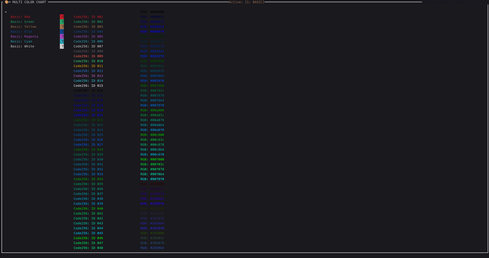

# Color Palette

This sample demonstrates the use of different color palettes in a terminal application using the Krow library. It showcases three types of color palettes: Basic, Code256, and RGB.

## What's in the Code?

The main components of the code include:

- **Block Object**: Provides a visual border around the color palette display.
- **List Objects**: Displays the different color palettes (Basic, Code256, RGB) in separate lists.
- **Color Conversion Function**: Converts RGB values to hexadecimal format for display.

```cpp
#include <chrono>
#include <iomanip>
#include <iostream>
#include <sstream>
#include <string>
#include <thread>
#include <vector>

#include "K10-K10/krow.h"

using namespace krow;

std::string rgb_to_hex(uint8_t r, uint8_t g, uint8_t b) {
  std::stringstream ss;
  ss << "#" << std::setfill('0') << std::setw(2) << std::hex << (int)r
     << std::setfill('0') << std::setw(2) << std::hex << (int)g
     << std::setfill('0') << std::setw(2) << std::hex << (int)b;
  return ss.str();
}

int main() {
  app.init();
  std::vector<Text> basic_items;
  std::vector<std::pair<std::string, style::BasicColor>> basic_colors = {
      {"Black", style::BasicColor::Black},
      {"Red", style::BasicColor::Red},
      {"Green", style::BasicColor::Green},
      {"Yellow", style::BasicColor::Yellow},
      {"Blue", style::BasicColor::Blue},
      {"Magenta", style::BasicColor::Magenta},
      {"Cyan", style::BasicColor::Cyan},
      {"White", style::BasicColor::White}};
  for (const auto& c : basic_colors) {
    Span s = "Basic: " + c.first;
    Line l_part = s.style(style::Default().fg(c.second));
    Line r_part = " TEXT "_s.style(
        style::Default().bg(c.second).fg(style::BasicColor::Black));
    basic_items.push_back(l_part.alignment_left() + r_part.alignment_right());
  }

  std::vector<Text> code256_items;
  for (int i = 0; i < 256; ++i) {
    std::string num_str = std::to_string(i);
    if (num_str.length() == 1) num_str = "00" + num_str;
    if (num_str.length() == 2) num_str = "0" + num_str;

    style::Style text_style;
    text_style.fg(style::Color(i));

    Span s = "Code256: ID " + num_str;
    Line l_part = s.style(text_style);

    Line r_part = " COLORBAR "_s.style(style::Default()
                                           .bg(style::Color(i))
                                           .fg(style::Color(i == 15 ? 0 : 15)));

    code256_items.push_back(l_part.alignment_left() + r_part.alignment_right());
  }

  std::vector<Text> rgb_items;
  for (int r = 0; r <= 255; r += 40) {
    for (int g = 0; g <= 255; g += 40) {
      for (int b = 0; b <= 255; b += 60) {
        std::string hex_name = rgb_to_hex(r, g, b);

        style::Style text_style;
        text_style.fg(style::Color(r, g, b));
        Span s = "RGB: " + hex_name;
        Line l_part = s.style(text_style);
        Line r_part = " [██████] "_s.style(style::Default()
                                               .bg(style::Color(r, g, b))
                                               .fg(style::Color(r, g, b)));

        rgb_items.push_back(l_part.alignment_left() + r_part.alignment_right());
      }
    }
  }

  Block window_box;
  window_box.position({0, 0, FULL, FULL});
  window_box.border_type(style::SINGLE);
  List list_basic, list_256, list_rgb;
  list_basic.position({2, 2, 30, 50});
  list_basic.items(basic_items);
  list_basic.selector_symbol("➔ ");

  list_256.position({34, 2, 50, 50});
  list_256.items(code256_items);
  list_256.selector_symbol("➔ ");

  list_rgb.position({68, 2, 50, 50});
  list_rgb.items(rgb_items);
  list_rgb.selector_symbol("➔ ");
  int active_tab = 0;
  app.loop([&]() {
    Line t_left = " 🎨 MULTI COLOR CHART "_s.style(
        style::Default().fg(style::BasicColor::White));
    std::string tab_name = (active_tab == 0)   ? "[1: BASIC]"
                           : (active_tab == 1) ? "[2: CODE256]"
                                               : "[3: RGB]";

    Span s = "Active: " + tab_name;
    Line t_center = s.style(style::Default().fg(style::BasicColor::Yellow));
    Line t_right = " Tab/Left/Right: Switch | Q: Exit "_s.style(
        style::Default().fg(style::BasicColor::Black));
    window_box
        .title(t_left.alignment_left() + t_center.alignment_center() +
               t_right.alignment_right())
        .bottom_title(t_left.alignment_left() + t_center.alignment_center());

    list_basic.selector_symbol(active_tab == 0 ? "➔ " : "   ");
    list_256.selector_symbol(active_tab == 1 ? "➔ " : "   ");
    list_rgb.selector_symbol(active_tab == 2 ? "➔ " : "   ");

    list_basic.draw();
    list_256.draw();
    list_rgb.draw();
    window_box.draw();

    input::key.read();
    auto key = input::key.getKeyCode();

    if (key == input::KeyCode::CHAR) {
      char c = input::key.getCurrentChar();
      if (c == 'q') app.stop();
      if (c == '1') active_tab = 0;
      if (c == '2') active_tab = 1;
      if (c == '3') active_tab = 2;
    }

    if (key == input::KeyCode::LEFT) {
      active_tab = (active_tab + 2) % 3;
    } else if (key == input::KeyCode::RIGHT) {
      active_tab = (active_tab + 1) % 3;
    }

    if (key == input::KeyCode::UP) {
      if (active_tab == 0) list_basic.move_up();
      if (active_tab == 1) list_256.move_up();
      if (active_tab == 2) list_rgb.move_up();
    } else if (key == input::KeyCode::DOWN) {
      if (active_tab == 0) list_basic.move_down();
      if (active_tab == 1) list_256.move_down();
      if (active_tab == 2) list_rgb.move_down();
    }
  });

  return 0;
}
```

## Key Bindings

- **Up Arrow**: Move the selection up in the active color palette list.
- **Down Arrow**: Move the selection down in the active color palette list.
- **Left Arrow**: Switch to the previous color palette tab.
- **Right Arrow**: Switch to the next color palette tab.
- **'q' Key**: Quit the application.

## Results

[](colour_palette.png)
