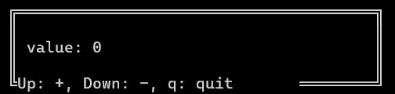

# Counter Example

This example demonstrates a simple counter application using the Terminal Library. The application displays a counter value that can be incremented or decremented using the UP and DOWN arrow keys, respectively. Pressing 'q' will quit the application.

## What's in the Code?
The main components of the code include:
- **Text Object**: Displays the current value of the counter.
- **Border Object**: Provides a visual border around the counter display.
- **Event Loop**: Continuously listens for user input to update the counter or exit the application.
- **Key Event Handling**: Listens for key presses to update the counter or quit the application.

```cpp
#include <K10-K10/terminal.h>
#include <string>

int main() {
  terminal::app.init();

  terminal::Block block;
  terminal::Rect border_position{0, 0, 40, 5};
  block.position(border_position).border_type(BorderType::DOUBLE);

  terminal::Text label;
  terminal::Rect label_position{2, 2, 7, 1};
  label.position(label_position).contents("value: ");

  terminal::Text counter;
  terminal::Rect counter_position{9, 2, 4, 1};    counter.position(counter_position).contents("0");

  terminal::Text description;
  terminal::Rect description_position{1, 4, 30, 1};
  description.position(description_position).contents("Up: +, Down: -, q: quit");

  terminal::app.loop([&]() {
    block.draw();
    label.draw();
    counter.draw();
    description.draw();

    terminal::input::key.read();
    auto key_code = terminal::input::key.getKeyCode();

    if (key_code == terminal::input::KeyCode::UP) {
      int value = std::stoi(counter.get_text());
      value++;
      counter.contents(std::to_string(value));
    } 
    else if (key_code == terminal::input::KeyCode::DOWN) {
      int value = std::stoi(counter.get_text());
      if (value > 0){
        value--;
      }
      counter.contents(std::to_string(value));
    } 
    else if (key_code == terminal::input::KeyCode::CHAR && terminal::input::key.getCurrentChar() == 'q') {
      terminal::app.stop();
    }     
  });

  return 0;
}
```

## Key bindings 
- **UP Arrow**: Increment the counter value.
- **DOWN Arrow**: Decrement the counter value (not going below 0).
- **'q' Key**: Quit the application.

## Results

It will display like this:

[](counter.gif)

---

__version__: *0.2.0* | __author__: *K10-K10* | __update__: 12/06/2026
