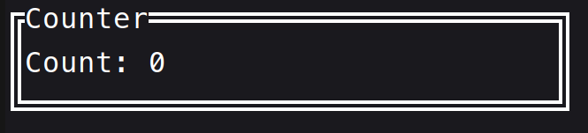

# Counter Example

This example demonstrates a simple counter application using Krow TUI. The application displays a counter value that can be incremented or decremented using the UP and DOWN arrow keys, respectively. Pressing 'q' will quit the application.

## What's in the Code?

The main components of the code include:

- **TextField Object**: Displays the current value of the counter.
- **Block Object**: Provides a visual border around the counter display.
- **Event Loop**: Continuously listens for user input to update the counter or exit the application.
- **Key Event Handling**: Listens for key presses to update the counter or quit the application.

```cpp
#include <K10-K10/krow.h>

#include <string>
using namespace krow;
int main() {
  app.init();
  TextField counter;
  Block block;
  block.position({0, 0, 32, 3}).border_type(style::DOUBLE).title({"Counter"_s});
  int cnt = 0;
  counter.position({1, 1, 30, 1});
  app.loop([&]() {
    block.draw();
    counter.contents({Line("Count: "_s) + Line(Span(std::to_string(cnt))
                                                   .style(style::Default().fg(
                                                       style::Color(130))))});
    counter.draw();
    input::key.read();
    auto key = input::key.getKeyCode();

    if (key == input::KeyCode::UP) {
      ++cnt;
    } else if (key == input::KeyCode::DOWN) {
      --cnt;
    }
  });
  return 0;
}

```

## Key bindings

- **UP Arrow**: Increment the counter value.
- **DOWN Arrow**: Decrement the counter value (not going below 0).

## Results

It will display like this:

[](counter.png)
