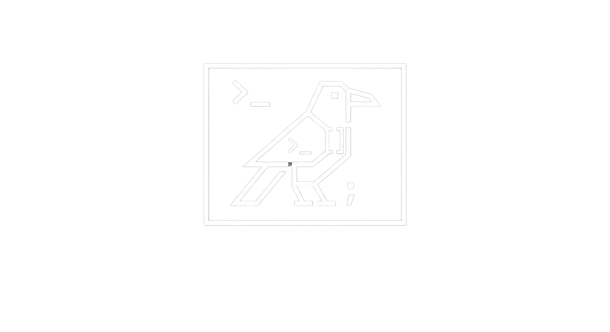

# Krow TUI



[](https://github.com/K10-K10/krowTUI/actions/workflows/build.yml)
[](https://github.com/K10-K10/krowTUI/actions/workflows/lint.yml)
[](https://github.com/K10-K10/krowTUI/releases)
[](https://github.com/K10-K10/krowTUI/releases)
[](https://github.com/K10-K10/krowTUI/blob/main/LICENSE)

## Quick start

### Installation

This library is header-only, so you can simply download the source code and include the necessary header files in your project.

#### Recommended method

You can use Cmake's `FetchContent` module to include the TUI library in your procejt.
Add the following lines to your `CMakeLists.txt`

```txt
include(FetchContent)

FetchContent_Declare(
    krowTUI
    GIT_REPOSITORY https://github.com/K10-K10/krowTUI
    GIT_TAG main # We suport only latest version, so use main branch
)

FetchContent_MakeAvailable(krowTUI)

add_executable(<your_app> main.cpp)
target_link_libraries(<your_app> PRIVATE K10-K10::krow)
```

Other methods is [here](Getting Started)

## Usage

You can directluy include header file:

```cpp
#include <K10-K10/krow.h>
```

## Example

```cpp
#include <K10-K10/krow.h>

using namespace krow;
int main() {
  app.init();
  Text text;
  text.contents("Hello TUI!");

  List list;
  list.items({"item1", "item2", "item3", "item4", "item5"});
  Block box;
  text.position({1, 1, 20, 1});
  list.position({1, 3, 20, 5});
  box.position({0, 0, FULL, FULL});
  app.loop([&]() {
    box.draw();
    text.draw();
    list.draw();

    input::key.read();
    auto key = input::key.getKeyCode();

    if (key == input::KeyCode::UP) {
      list.move_up();
    }
    if (key == input::KeyCode::DOWN) {
      list.move_down();
    }
    if (key == input::KeyCode::CHAR) {
      char c = input::key.getCurrentChar();
      if (c == 'q') {
        app.stop();
      }
    }
  });

  return 0;
}
```

## Documentations

- [Getting Started](docs/getting_started.md)
- [API Reference](docs/references.md)
- [Examples](docs/examples.md)
- [Points to Note](docs/points.md)
- [Samples](docs/samples.md)
- [Changelog](docs/changelog.md)

## License

This project is licensed under the MIT License - see the [LICENSE](LICENSE) file for details.
