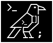

# Krow TUI



[](https://github.com/K10-K10/krowTUI/actions/workflows/build.yml)
[](https://github.com/K10-K10/krowTUI/actions/workflows/lint.yml)
[](https://github.com/K10-K10/krowTUI/releases)
[](https://github.com/K10-K10/krowTUI/releases)
[](https://github.com/K10-K10/krowTUI/blob/main/LICENSE)

## Quick start

### Installation

This library is header-only, so you can simply download the source code and include the necessary header files in your project.

#### Recommended method

You can use Cmake's `FetchContent` module to include the TUI library in your procejt.
Add the following lines to your `CMakeLists.txt`

```txt
include(FetchContent)

FetchContent_Declare(
    krowTUI
    GIT_REPOSITORY https://github.com/K10-K10/krowTUI
    GIT_TAG main # We suport only latest version, so use main branch
)

FetchContent_MakeAvailable(krowTUI)

add_executable(<your_app> main.cpp)
target_link_libraries(<your_app> PRIVATE K10-K10::krow)
```

Other methods is [here](Getting Started)

## Usage

You can directluy include header file:

```cpp
#include <K10-K10/krow.h>
```

## Example

```cpp
#include <K10-K10/krow.h>

using namespace krow;
int main() {
  app.init();
  TextField label;
  Line l = "Hello TUI!"_s.style(style::Default().bold());
  Text text = l.alignment_left();
  label.contents({text});

  List list;
  list.items({Text("item1"_s), Text("item2"_s), Text("item3"_s),
              Text("item4"_s), Text("item5"_s)});
  Block box;
  label.position({1, 1, 20, 1});
  list.position({1, 3, 20, 5});
  box.position({0, 0, FULL, FULL});
  app.loop([&]() {
    box.draw();
    label.draw();
    list.draw();

    input::key.read();
    auto key = input::key.getKeyCode();

    if (key == input::KeyCode::UP) {
      list.move_up();
    }
    if (key == input::KeyCode::DOWN) {
      list.move_down();
    }
    if (key == input::KeyCode::CHAR) {
      char c = input::key.getCurrentChar();
      if (c == 'q') {
        app.stop();
      }
    }
  });

  return 0;
}
```

## Documentations

- [Getting Started](docs/getting_started.md)
- [API Reference](docs/references.md)
- [Examples](docs/examples.md)
- [Points to Note](docs/points.md)
- [Samples](docs/samples.md)
- [Changelog](docs/changelog.md)

## License

This project is licensed under the MIT License - see the [LICENSE](LICENSE) file for details.

### Third-Party Notices

This project uses `ncurses` library. It's license is included below.

```text
Copyright 2018-2021,2023 Thomas E. Dickey
Copyright 1998-2016,2017 Free Software Foundation, Inc.
Author: Zeyd M. Ben-Halim <zmbenhal@netcom.com> 1992,1995
   and: Eric S. Raymond <esr@snark.thyrsus.com>
   and: Thomas E. Dickey                        1996-on

Permission is hereby granted, free of charge, to any person obtaining a
copy of this software and associated documentation files (the
"Software"), to deal in the Software without restriction, including
without limitation the rights to use, copy, modify, merge, publish,
distribute, distribute with modifications, sublicense, and/or sell
copies of the Software, and to permit persons to whom the Software is
furnished to do so, subject to the following conditions:

The above copyright notice and this permission notice shall be included
in all copies or substantial portions of the Software.

THE SOFTWARE IS PROVIDED "AS IS", WITHOUT WARRANTY OF ANY KIND, EXPRESS
OR IMPLIED, INCLUDING BUT NOT LIMITED TO THE WARRANTIES OF
MERCHANTABILITY, FITNESS FOR A PARTICULAR PURPOSE AND NONINFRINGEMENT.
IN NO EVENT SHALL THE ABOVE COPYRIGHT HOLDERS BE LIABLE FOR ANY CLAIM,
DAMAGES OR OTHER LIABILITY, WHETHER IN AN ACTION OF CONTRACT, TORT OR
OTHERWISE, ARISING FROM, OUT OF OR IN CONNECTION WITH THE SOFTWARE OR
THE USE OR OTHER DEALINGS IN THE SOFTWARE.
```
