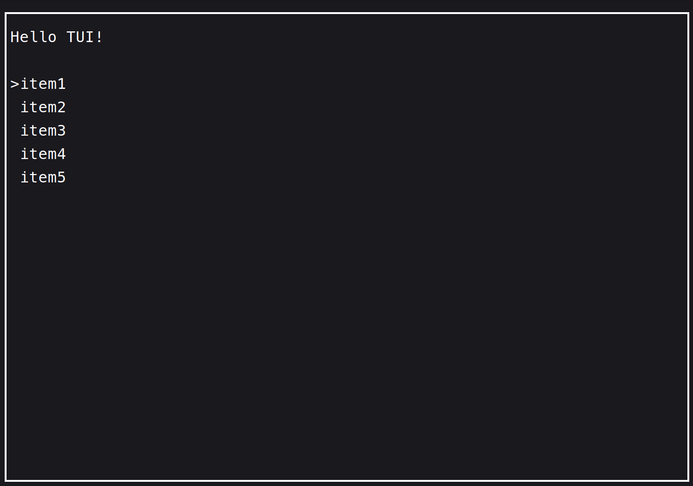

# Examples

Here are some examples of how to use the TUI library in C++.

```cpp
#include <K10-K10/krow.h>

using namespace krow;
int main() {
  app.init();
  TextField label;
  Line l = "Hello TUI!"_s.style(style::Default().bold());
  Text text = l.alignment_left();
  label.contents({text});

  List list;
  list.items({Text("item1"_s), Text("item2"_s), Text("item3"_s),
              Text("item4"_s), Text("item5"_s)});
  Block box;
  label.position({1, 1, 20, 1});
  list.position({1, 3, 20, 5});
  box.position({0, 0, FULL, FULL});
  app.loop([&]() {
    box.draw();
    label.draw();
    list.draw();

    input::key.read();
    auto key = input::key.getKeyCode();

    if (key == input::KeyCode::UP) {
      list.move_up();
    }
    if (key == input::KeyCode::DOWN) {
      list.move_down();
    }
    if (key == input::KeyCode::CHAR) {
      char c = input::key.getCurrentChar();
      if (c == 'q') {
        app.stop();
      }
    }
  });

  return 0;
}

```

And this is minimal `CMakeLists.txt` to build the example:

```cmake
cmake_minimum_required(VERSION 3.16)
project(app LANGUAGES CXX)

include(FetchContent)

FetchContent_Declare(
  KrowTUI
  GIT_REPOSITORY https://github.com/K10-K10/KrowTUI
  GIT_TAG        main
)

FetchContent_MakeAvailable(KrowTUI)

add_executable(app src/main.cpp)

target_link_libraries(app PRIVATE K10-K10::krow)
```



### KeyBindings

- `UP`: Move up in the list
- `DOWN`: Move down in the list
- `q`: Quit the application
